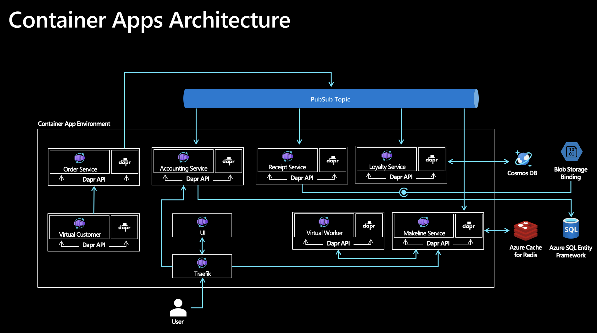
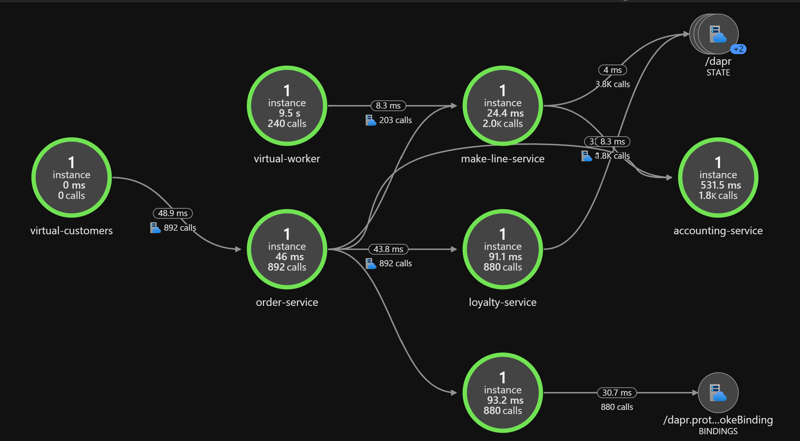

# Microservices architecture on Azure Container Apps with Dapr

Microservices are an increasingly popular architecture style that can have many benefits including high scalability, shorter development cycles, and increased simplicity. Containers are often used as a mechanism to deploy microservices applications and a container orchestrator such as Kubernetes becomes more useful as the number of services in the solution grows. However, there are a number of factors that must be considered for large scale microservices architectures and typically the infrastructure platform requires significant understanding of complex technologies such as container orchestrators.

[Azure Container Apps](https://azure.microsoft.com/services/container-apps/) (Preview) is a fully managed serverless container service for running modern applications at scale. It enables developers to deploy containerized apps without managing complicated infrastructure through abstraction of the underlying platform and is powered by open-source technologies.

This architecture leverages Azure Container Apps integration with a managed version of the [Distributed Application Runtime (Dapr)](https://dapr.io/). Dapr is an open source project that helps developers with the inherent challenges presented by distributed applications, such as state management and service invocation.

In addition, Container Apps provides a managed version of [Kubernetes Event Driven Autoscaling (KEDA)](https://keda.sh/). KEDA allows your containers to autoscale based on incoming events from external services such Azure Service Bus and Redis.

HTTPS ingress can also be enabled in Azure Container Apps without the creation of any additional Azure networking resources. This is done using the [Envoy proxy](https://www.envoyproxy.io/) and allows for traffic splitting scenarios as well.

To explore how Azure Container Apps compares to other container hosting platforms in Azure, see [Comparing Container Apps with other Azure container options](/azure/container-apps/compare-options). Note that Azure Container Apps is currently in Public Preview and so not recommended for production workloads. 

This article describes a solution for running an order management system with ten microservices on Azure Container Apps while leveraging microservices best practices through Dapr and event-driven scaling with KEDA.

## Potential use cases

This solution applies to any organization that utilizes stateless and stateful microservices for distributed systems. The solution is especially suitable for consumer packaged goods and manufacturing industries who have a ordering and fulfillment system.

These other uses cases have similar design patterns:
- Microservices architecture on AKS
- Microservices architecture on Azure Functions
- Event-driven architectures

## Architecture



This solution leverages Bicep templates to execute the deployment of the Reddog Order Management System and its supporting Azure infrastructure. The architecture is comprised of a single Container Apps Environment that hosts ten .NET Core microservice applications. The .NET Core Dapr SDK is used to integrate with Azure resources through PubSub, State and Binding building blocks and while Dapr typically provides flexibility around the component implementations, this solution is opinionated. The services also make use of KEDA scale rules to allow for scaling based on event triggers as well as scale to zero scenarios.

Each microservice is described below followed by the Container Apps configuration that it is deployed with. The code for the services can be found on [GitHub](https://github.com/Azure/reddog-code).

- Traefik: Basic proxy for routing user requests from the UI to the Accounting and Makeline services for the interactive dashboard.

- UI: Dashboard showcasing realtime order and aggregated sales data for the Reddog Order Management System.

- Virtual Customer: 'Customer simulation' program that simulates customers placing orders via the Order Service.

- Order Service: CRUD API for placing and managing orders.

- Accounting Service: Service that processes, stores and aggregates order data, transforming customer orders into meaningful sales metrics to be showcased via the UI.

- Receipt Service: Archival program that generates and stores order receipts for auditing and historical purposes.

- Loyalty Service: Manages the loyalty program by tracking customer reward points based on order spend.

- Makeline Service: Responsible for managing a queue of current orders to be fulfilled. Tracks the processing and completion of the orders by the Virtual Worker Service.

- Virtual Worker: 'Worker simulation' program that simulates the completion of customer orders.

- Bootstrapper (not shown): A service that leverages Entity Framework Core to initialize the tables within Azure SQL Database for use with the Accounting Service.


| Service          | Ingress |  Dapr Component(s) | KEDA Scale Rule(s) |
|------------------|---------|--------------------|--------------------|
| Traefik | External | Dapr not enabled | HTTP |
| UI | Internal | Dapr not enabled | HTTP |
| Virtual Customer | None | Service to Service Invocation | N/A |
| Order Service | Internal | PubSub: Azure Service Bus | HTTP |
| Accounting Service | Internal | PubSub: Azure Service Bus | Azure Service Bus Topic Length, HTTP |
| Receipt Service | Internal | PubSub: Azure Service Bus, Binding: Azure Blob | Azure Service Bus Topic Length |
| Loyalty Service | Internal | PubSub: Azure Service Bus, State: Azure Cosmos DB | Azure Service Bus Topic Length |
| Makeline Service | Internal | PubSub: Azure Service Bus, State: Azure Redis | Azure Service Bus Topic Length, HTTP |
| Virtual Worker | None | Service to Service Invocation, Binding: Cron | N/A |

> [!NOTE]
> Bootstrapper is also be executed in a Container App. However, this service is run once to perform the database creation and is subsequently scaled to 0 after creating the necessary objects in Azure SQL Database.

### Components

This solution uses the following components:

- [Resource Groups](/azure/azure-resource-manager/management/manage-resource-groups-portal) are logical containers for Azure resources.  We use a single resource group to structure everything related to this solution in the Azure portal.
- [Azure Container Apps](/azure/container-apps) is a fully managed serverless container service for building and deploying modern apps at scale. In this solution we hosting all of the 10 microservices on Container Apps and deploying them into a single Container App Environment, which acts as a secure boundary around the system.
- [Azure Service Bus](/azure/service-bus-messaging/) is a fully managed enterprise message broker complete with queues and publish-subscribe topics used in this case for the Dapr PubSub component implementation. This component is leveraged by multiple services, with the Order Service publishing messages on the bus and the Makeline, Accounting, Loyalty and Receipt services subscribing to these messages.
- [Azure CosmosDB](/azure/cosmos-db/) is a NoSQL multi-model managed database  service that is used as a Dapr State Store component for the Loyalty Service to store customer's loyalty data.
- [Azure Cache for Redis](/azure/azure-cache-for-redis/) is a distributed, in-memory, scalable managed Redis cache. It is used as a Dapr State Store component for the Makeline Service to store data on the orders that are being processed.
- [Azure SQL Database](/azure/azure-sql/) is an intelligent, scalable, relational database service built for the cloud. It is created for the Accounting Service, which makes use of [Entity Framework Core](/ef/core/) for interfacing with the database. The Bootstrapper Service is responsible for setting up the SQL Tables in the database and runs once before connection to the Accounting Service is established.
- [Azure Blob Storage](/azure/storage/blobs/) is optimized for storing massive amounts of unstructured data such as text or binary files. Blob storage is used by the Receipt Service via a Dapr Output Bindings to store the order receipts.
- [Traefik](https://traefik.io/traefik/) is a leading modern reverse proxy and load balancer that makes deploying microservices easy. In this solution we are making use of Traefik's dynamic configuration feature to do path-based routing from the UI (a Vue.js SPA) and to enable direct API calls to the backend services for testing.
- [Azure Monitor](/azure/azure-monitor/) enables you to collect, analyze, and act on telemetry data from your Azure infrastructure environments. It is used along with [Application Insights](/azure/azure-monitor/app/app-insights-overview) to view the container logs and collect metrics from the microservices.

### Alternatives

In this architecture Traefik proxy was deployed to enable path based routing for the Vue JS API. There are a myriad of alternative open-source proxies that can be used for this purpose. Two other popular projects are [NGINX](https://www.nginx.com/) and [HAProxy](https://www.haproxy.com/).

All Azure infrastructure, save Azure SQL Database, used Dapr components for interoperability. One benefit of Dapr is that all these components can all be swapped easily by changing the container apps deployment configuration. In this case Azure Service Bus, CosmosDB, Cache for Redis and Blob Storage were all chosen to showcase some of the 70+ Dapr components available. Alternative [pubsub brokers](https://docs.dapr.io/reference/components-reference/supported-pubsub/), [state stores](https://docs.dapr.io/reference/components-reference/supported-state-stores/) and [output bindings](https://docs.dapr.io/reference/components-reference/supported-bindings/) are listed in the Dapr docs.

## Considerations

### Availability

Since Azure Container Apps is in Public Preview there is no SLA available today.

Azure Monitor and App Insights are used for monitoring Azure Container Apps. You can view container logs by navigating to the Logs blade in each container app in the portal and running the Kusto query below. This example shows logs for the Makeline Service app.

```kusto
ContainerAppConsoleLogs_CL |
    where ContainerAppName_s contains "make-line-service" |
    project TimeGenerated, _timestamp_d, ContainerGroupName_s, Log_s |
    order by _timestamp_d asc
```

The Application Map in App Insights also showcases how the services are communicating in real time and can be used for debugging scenarios. Navigate to the Application Map under the Application Insights resource to view something similar to the following.



For more information on monitoring Container Apps, see [Monitor an app in Azure Container Apps](/azure/container-apps/monitor).

### Scalability

This solution relies heavily on the KEDA implementation in Azure Container Apps for event-driven scaling. When deployed the Virtual Customer service will continuously place orders causing the Order Service to scale up via the HTTP KEDA scaler. As the Order Service publishes the orders on the service bus, the Service Bus KEDA scalers will cause the four subscribers (Accounting, Receipt, Makeline and Loyalty) to scale up as well. The UI and Traefik Container Apps also have HTTP KEDA scalers configured so that they scale as more users are accessing the dashboard.

When Virtual Customer is not running all microservices in this solution will scale to zero except for Virtual Worker and Makeline Service since the Virtual Worker is constantly checking for orders to be fulfilled. For more information on scaling in container apps, see [Set scaling rules in Azure Container Apps](/azure/container-apps/scale-app). For more information on KEDA Scalers, read the [KEDA documentation on Scalers](https://keda.sh/docs/latest/scalers/).

### Resiliency

Azure Container Apps runs on Kubernetes behind the scenes. Built into Kubernetes are resiliency mechanisms that monitor and restart containers (pods) if there are issues. This combined with the built-in load balancing for running multiple replicas of each container app allows for this solution to tolerate an instance being unavailable.

## Deploy this scenario

For deployment instructions see the 'Getting Started' section on [GitHub](https://github.com/Azure/reddog-containerapps/blob/main/README.md#getting-started).

> [!NOTE]
> While Azure Container Apps is in Public Preview it is not recommended for production workloads. The service is also only available in [a subset of Azure regions today](https://azure.microsoft.com/en-ca/global-infrastructure/services/?products=container-apps).

## Next steps

- [Azure Container Apps docs](/azure/container-apps/)
- [Comparing container offerings in Azure](/azure/container-apps/compare-options)
- Other Reddog Order Management System Implementations:
  - [Azure Arc hybrid deployment](https://github.com/Azure/reddog-hybrid-arc)
  - [AKS deployment](https://github.com/Azure/reddog-aks)
  - [Local development](https://github.com/Azure/reddog-code/blob/master/docs/local-dev.md)

## Related resources

- [Microservices architecture on AKS](/azure/architecture/reference-architectures/containers/aks-microservices/aks-microservices)
- [Advanced AKS microservices architecture](/azure/architecture/reference-architectures/containers/aks-microservices/aks-microservices-advanced)
